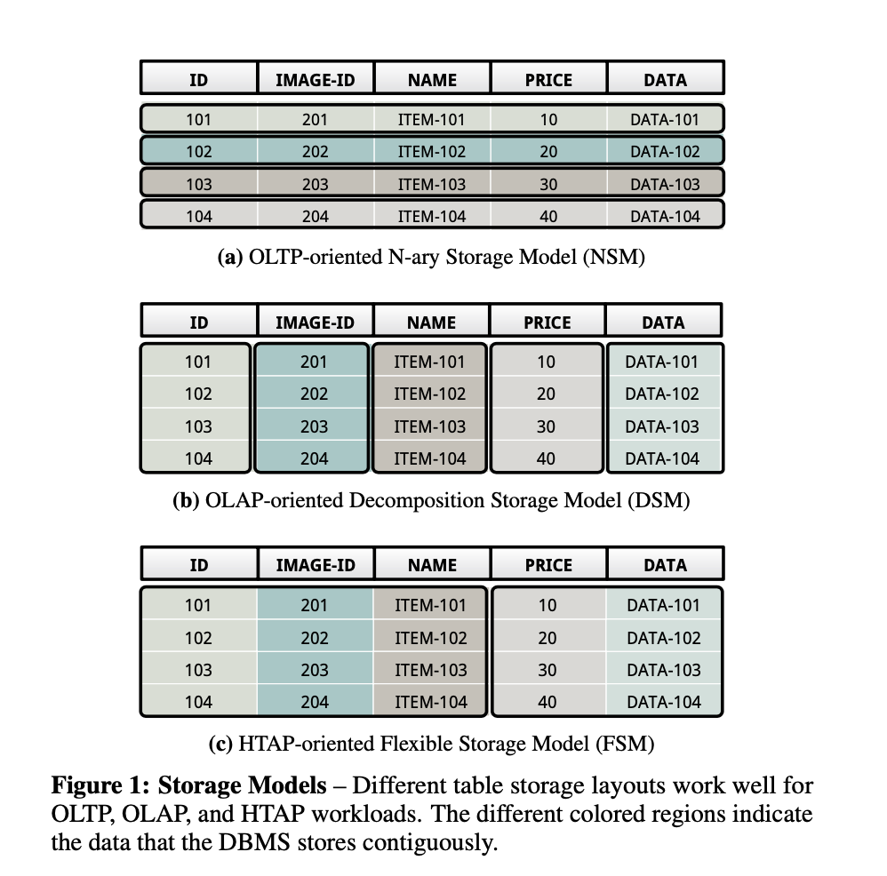
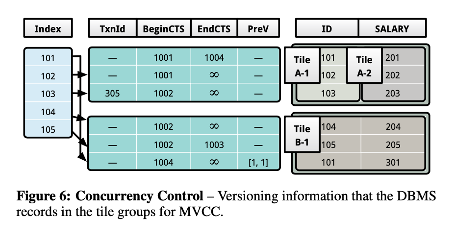

# Bridging the Archipelago between Row-Stores and Column-Stores for Hybrid Workloads

note: due to limited time, this ppt is mainly focusing on the hybrid storage model and it's automation process as I think they are two of the most important and interesting bits presented in the paper.

---

# Abstract

A hybrid DBMS architecture that efficiently supports varied workloads on the same database.

* Using a single execution engine that is oblivious to the storage layout of data without sacrificing the performance benefits of the specialized systems.
* Using a technique to continuously evolve the database’s physical storage layout by analyzing the queries’ access patterns and choosing the optimal layout for different segments of data within the same table.

---

# Storage Models

---

# FSM

---

# Layout Reorganization

* On-line Query Monitoring
* Partitioning Algorithm
* Data Layout Reorganization

---

# Layout Reorganization: On-line Query Monitoring

* Maintaining time-series data on the queries (both SELECT and WHERE attributes for better predicate eval performance).
* To reduce the monitoring overhead, the monitor only gathers statistics from a random subset of queries.
* To optimize the layout for both the transactions and the data intensive analytical queries, the DBMS records the query plan cost computed by the optimizer.

---

# Layout Reorganization: Partitioning Algorithm

* Runtime Complexity: O(m * n * k)
* Space Complexity:   O(n* (m + k))
* Vertical Partitioning Algorithm (as it isn't feasible to examine 2n groups of attributes and analyze all the possible attribute partitions of the table).
* An attractive feature of the on-line clustering algorithm is that, over time, the means of the clusters drift towards the recent samples.

---

# Layout Reorganization: Data Layout Reorganization

* The reorganization process does not target hot tile groups that are still being heavily accessed by OLTP transactions.
* To isolate exploratory workloads with ad-hoc OLAP queries, the DBMS prioritizes the older query samples in the clustering algorithm with a larger weight, thereby dampening the adaptation mechanism. On the other hand, if the workload shift is not ephemeral, then it proceeds with the reorganization.

---

# Concurrency Control

---

# Concurrency Control

1. When a new transaction is started, the DBMS assigns it a unique transaction identifier from a monotonically in- creasing global counter.
2. When a transaction is ready to commit, the DBMS assigns it a unique commit timestamp that it obtains by incrementing the timestamp of the last committed transaction. Each transaction maintains a metadata context that includes:
  a. The timestamp of the last committed transaction should be visible to this transaction.
  b. References to the set of tuple versions that the transaction either inserts or deletes during its lifetime.

---

# Thoughts/Intuitions

* Adoption seems still not very common?
  * Mostly just two example implementations from Carnegie Mellon University ([peloton](https://github.com/cmu-db/peloton) and [noisepage](https://github.com/cmu-db/noisepage))
  * TiDB: still favors the old fashioned of a row column split implementation [(TiKV and TiFlash)](https://docs.pingcap.com/tidb/dev/tidb-storage)
  * CockroachDB: no mention of dedicated column or row support
  * more?
* Layout reorganization still has latency/lags on hot tile groups (realtime data)
* Inaccurate or untimely re-organization might potentially lead to unpredictable tail latencies and other performance issues.
