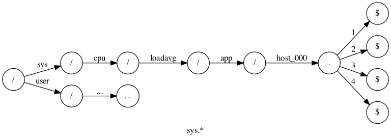
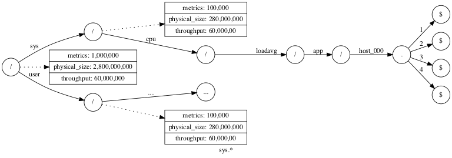
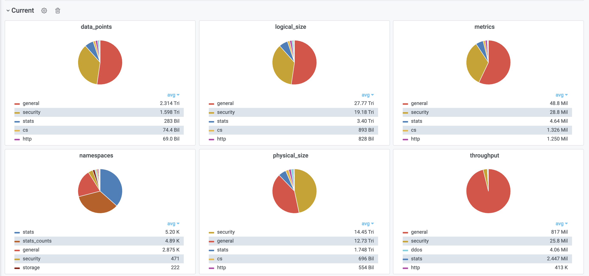

# Graphite Quota/Usage: Metrics of Metrics

Like an inception.

This is about a new neat thing for the Go-Graphite storage program: [Go-Carbon](https://gitlab.booking.com/graphite/go-carbon).

(Xiaofan Hu @ Time Series)

<!--
---

# What is Graphite and Graphite at Booking.com

Graphite is a timeseries database. An example of graphite metric path: `sys.app-01.cpu.total.user`.

Some numbers:

* 400 millions unique metrics and 1.2 billions if counting replicas (stale metrics are being constantly pruned)
* 700 TB of disk usage
* 1000+ query requests per second
 -->

---

# Why

To keep Graphite alive when there are "unscheduled" metric growth or bugs that produces high amount of metrics.

(and it started with a slack chat with Anton Timofieiev.)

---

# How-1

Overall idea: maintaining the usage on the directory nodes on the Go-Carbon's internal trie index tree, and whenever metrics are being sent to the system, Go-Carbon would check if it's a new metric and if there is enough quota left for its matching rules in the system.

(The devils are in the details.)

---



---



---

# How-2

There are 6 controls available: `throughput`, `physical-size`, `logical-size`, `metrics`, `namespaces`, `data-points`.

---

# An Example

```ini
# For all namespaces bellow root
[*]
metrics       =      1,000,000
throughput    =     60,000,000
physical-size = 50,000,000,000 # 50GB

# For root level throttling
[/]
metrics       =      10,000,000
throughput    =     600,000,000
physical-size = 250,000,000,000 # 250GB
```

With every quota rules, metrics for quotas, usages, and throttles are generated. Nice dashboards and alarms could be built on top of them.

---



---


---

# Where

It's still being slowly released on our production and for now we are looking at enforcing the quotas on root level.

However, the usages of various namespaces/prefixes that are being collected are giving us great visibility on our users.

If needed, we can quickly enable throttling on the targeted namespaces.

---

# Fun Fact

Go map is much faster than a home-baked trie tree traversing.

It's so good that it actually saves us 5 CPU cores when it comes to throttling on over 1 million data points per second.

(In hindsight, it makes sense. I was just not expecting multiple map lookup are still faster than one trie tree traversal.)

---

# Links

* [The Quota Pull Request on Github](https://github.com/go-graphite/go-carbon/pull/420).
* [How the Go map helps cutting down our cpu usage](https://github.com/go-graphite/go-carbon/pull/420/commits/3a7a882e04f65994f3816d0ec6436422c5c539b0).
* [More Quota docs for Go-Graphite/Go-Carbon](https://github.com/go-graphite/go-carbon/blob/3a7a882e04f65994f3816d0ec6436422c5c539b0/doc/quotas.md).
