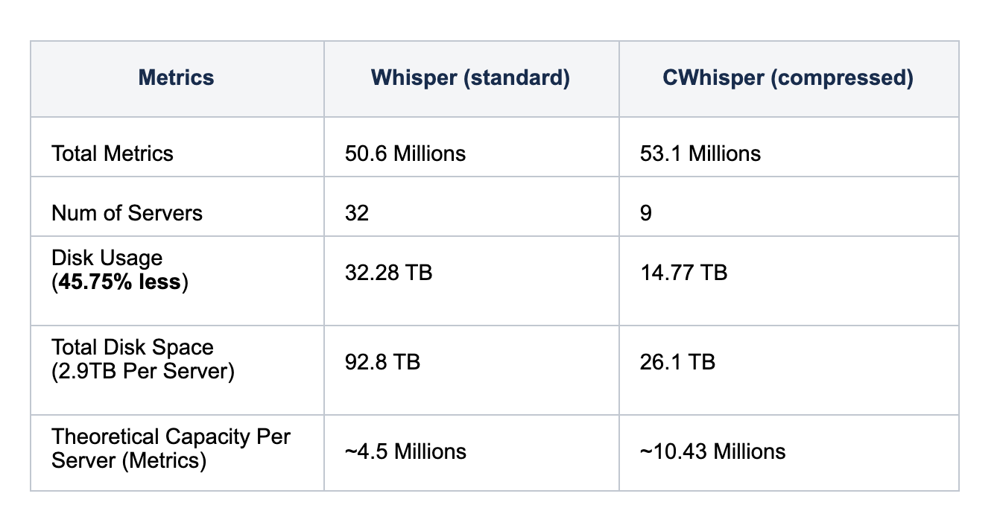
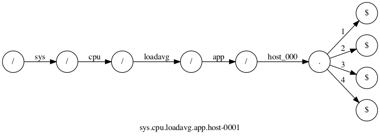
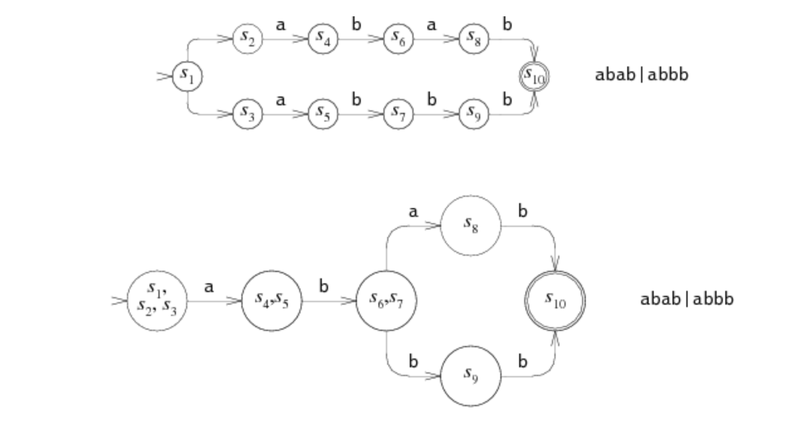

# Whispering in the trees

## Scaling go-carbon, the go-graphite stroage stack at Booking.com

Xiaofan Hu @ Booking.com

(note: puns intended in the title)

---

# Context

* I'm not one of the Graphite service owner
* It's a vertical scaling story

---

# What is Graphite

Graphite is a time-series database. It was originally written in python (mainly), the whole tool consists of multiple components like:

* frontend carbon API for returning timeseries data or graphite-web for rendering graph
* relay (for scaling and duplicating data)
* storage: carbon and whisper
* admin tooling: buckytools

---

credit: https://github.com/graphite-project/whisper

---

# Graphite at Booking

No longer a vanilla setup, various components are rewritten (some more than once), for example:

* [carbonapi](https://github.com/go-carbon/carbonapi)/[bookingcom fork](https://github.com/bookingcom/carbonapi), rewritten by [Damian Gryski](https://github.com/dgryski), [Vladimir Smirnov](https://github.com/Civil) and many others.
* relay is now [nanotube](https://github.com/bookingcom/nanotube) written by [Roman Grytskiv](https://github.com/grzkv), [Andrei Vereha](https://github.com/avereha), and [Gyanendra Singh](https://github.com/gksinghjsr) from our Graphite team, (it was preceded by [carbon-c-relay](https://github.com/grobian/carbon-c-relay) written by [Fabian Groffen](https://github.com/grobian))
* [go-carbon](https://github.com/go-graphite/go-carbon) for storage, written by [Roman Lomonosov](https://github.com/lomik)

My story today is mainly about the storage program: go-carbon.

---

# Just as an exploration

I came upon our graphite go stack in a hackathon in 2018. Then later that year I learned about the Gorilla timeseries data compression algorithm. When I tried to figure out what compression algorithm graphite is using, I noticed that it's not compressing data. So I decided to give it a shot by introducing the algorithm to the system.

---

# Graphite Metric Basics

* An example of graphite metric: `sys.cpu.loadavg.app.host-0001`
* An example of graphite retention policy and aggregation policy: `1s:2d,1m:30d,1h:2y avg`
	* size of the retention example: (86400\*2 + 1440\*30 + 24\*730) \* 12 = 2,802,240 bytes
	* 1s:2d is called an archive (same for 1m:30d and 1h:2y)
* A typical graphite data point: `1600027497: 42` (a 32 bit timestamp and a 64 bit value)

---

# What is Whisper

In graphite, each metric is saved in a file, using the a round-robin database format, named [whisper](https://www.aosabook.org/en/graphite.html). Important properties:

* Data point addressable: given a random timestamp and a target archive, its location could be inferred in the whisper file, which means that it is programmably trivial to support out-of-order data and rewrite
* Fixed size: each data point has a fixed size of 12 bytes (4 bytes for timestamp, 8 bytes for value and yes, one more thing to fix before 2038)

---

# What is Gorilla compression

* An compression algorithm published in VLDB '15: Gorilla: [Facebook's Fast, Scalable, In-Memory Time Series Database](https://www.vldb.org/pvldb/vol8/p1816-teller.pdf)
* It has great compression performance for time series data (__payload dependent__)
* It has seen wide adoption since then: [M3DB](https://m3db.github.io/m3/m3db/), [Prometheus](https://fabxc.org/tsdb/), [Timescale](https://blog.timescale.com/blog/time-series-compression-algorithms-explained/), [VictoriaMetrics](https://medium.com/faun/victoriametrics-achieving-better-compression-for-time-series-data-than-gorilla-317bc1f95932), etc.

---

# The core of the Gorilla algorithm

* Delta encoding for timestamps
	To be precise, it's actually the delta of delta
* XOR for values
	Built on the assumption that time series data tend to have constant/repetitive values, or values fluctuating within a certain range, this means that XOR with the previous value often has leading and trailing zeros, and we can only save mostly just the meaningful bits

---

---

# Best case example

| # | timestamp  | value  |
|---|---|---|---|
| #1 | 1600000000  |  0 |
| #2 | 1600000001  |  0 |
| #3 | 1600000002  |  0 |
| ... | ...  |  0 |
| #100 | 1600000099  |  0 |

With the compression algorithms introduced in the gorilla paper, other than the first two data points, the rest of them could be compressed with 2 bits.

---

# How to combine Gorilla and Whisper

A new file format needs to be designed from scratch in order to compress data points using the gorilla algorithm.

---

# CWhipser (Compressed Whisper)

* Still a round robin database
* File size isn't fixed (would grow/extend over time)
* Archives are split into many blocks (ideally consist of 7200 data points per archive)
* No longer data point addressable (means hard to support rewrite and limited out-of-order range)

---

# Result

---

# New challenge

While now that go-carbon can save 10+ million metrics in a single instance, the query index (trigram index) that we are using on production is a new ceiling. This was one of th reason that in practice, our go-carbon instance didn't usually serve more 5 millions metrics.

---

# Globbing graphite metrics

A most simple graphite query: `sys.cpu.loadavg.app.host-0*`

It's basically the same as globbing in shell: `ls /sys/cpu/loadavg/app/host-0*`

---

# filepath.Match/Glob (Go stdlib)

Pro: simple to implement

Con: high performance cost in a large file tree (millions of files)

`filepath.Glob` in Go is an userspace implementation, so it first needs to ask the kernel for all the files and then globs over it. Therefore the overhead is a high when serving millions of files.

---

# Trigram (part 1)

There is alternative implementation in go-carbon, which is using trigram, originally implemented by Damian Gryski.

TLDR: it breaks downs all the metrics as trigrams, and maps the trigram to the metrics (an inverted index). A glob query is also convert as a trigrams, then intersects the metric trigrams and query trigrams, then it would use the glob to make sure the files match the query.

---

# Trigram (part 2)

Pro:

* faster than standard library (no syscalls after index, and file list are cached in memory)

Con:

* index is expensive to build when dealing higher number of metrics (above 5 millions or more)
* result returned by trigram index aren't always matching the query, so it still falls back to `filepath.Match` to double check

(trigram itself is a pretty big topic, so sorry that I can't explain all its glory too much)

---

# Trie + NFA/DFA (part 1)

---

# Trie + NFA/DFA (part 2)

---

# Trie + NFA/DFA (part 3)

TLDR: index all the metrics in go-carbon instance with trie, compile the glob queries first as NFA (then DFA during walking). And walking over the trie and NFA/DFA at the same time.

More details about NFA and DFA could be found in https://swtch.com/~rsc/regexp/regexp1.html

---

# Trie + NFA/DFA (part 4)

Pro:

* faster index time
* less memory usage
* no standard library fallback
* better/predictable performance

Con:

* Certain types of queries are faster using trigram (like `foo.*bar.zoo`, because of the leading star, the new index algorithm needs to travel the whole namespace, however, arguably, you can design your metric namespace properly to avoid this issue)

---

# Result

---

# Tips

More common names should come before less common and unique names in the metric: less memory usage and faster query.

`sys.cpu.loadavg.app.host-0001` performs better than `sys.app.host-0001.cpu.loadavg` using trie index + nfa/dfa.

Because in the first naming pattern, `sys.cpu.loadavg` is just one copy of string in the trie index and comparison is done only once.

---

# Usage

* Challenges on rolling out compressed whisper at Booking
	* Out of order
	* Rewrite
* Trie+NFA/DFA index solution made it to our production!

---

# Debugging and testing

* For working on new file format, being able to analyze the bytes and tooling for migrations: [cmd/compare](https://github.com/go-graphite/go-whisper/blob/master/cmd/compare.go), [cmd/dump](https://github.com/go-graphite/go-whisper/blob/master/cmd/dump.go), etc
* Testing using production queries
* Fuzzing and randomized input

---

# Retro

* Special thanks to [Alexey Zhiltsov](https://github.com/azhiltsov) (best sysadmin) and our Graphite team!
* It was a great learning journey: designing and implementing the technologies!
* Challenging/improving existing stack is hard
* Testing, debugging and tooling is important!
